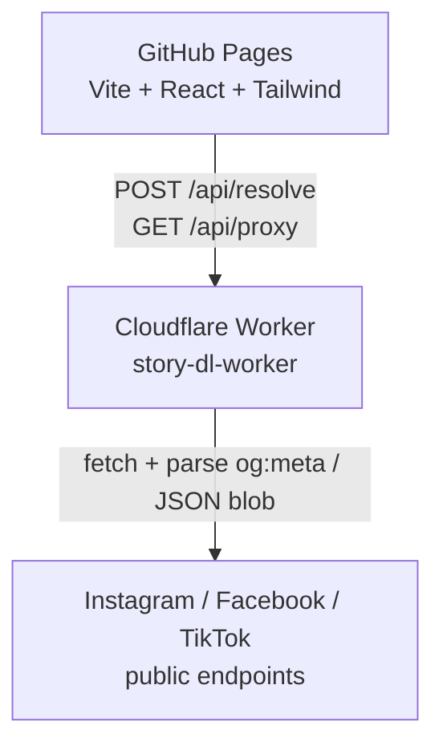

# Social Downloader — Free Online Instagram, Facebook & TikTok Video Downloader

> Save public **Reels, Posts, IGTV, Facebook Videos and TikTok videos**
> straight to your device — no signup, no software. Paste a link, hit
> download.

**🌐 Live demo:** [koniz-dev.github.io/story-downloader](https://koniz-dev.github.io/story-downloader/)
&nbsp;•&nbsp; **🌍 5 languages:** English · Tiếng Việt · 日本語 · 한국어 · 中文

---

## Why use it

- **🎬 Instagram Reel & Post downloader** — Reels, photo posts, carousels, IGTV.
- **📘 Facebook video downloader** — public posts, Reels, Watch videos, fb.watch
  short links.
- **🎵 TikTok video downloader** — public videos, photo slideshows, vm.tiktok.com
  and tiktok.com/t/ short links. Watermarked.
- **⚡ One-click downloads** — paste the URL, get a direct save-to-disk button.
- **🔒 Private by design** — runs entirely in your browser + a stateless
  serverless Worker. No accounts, no tracking pixels, no history kept.
- **💸 Free forever** — frontend on GitHub Pages, backend on Cloudflare Workers'
  free tier. No ads, no paywall.
- **🌐 Multilingual UI** — auto-detects your browser language; switch any time.

## Supported content

| Platform  | Supported                                       | Notes                                         |
| --------- | ----------------------------------------------- | --------------------------------------------- |
| Instagram | Reel, Post (single image + carousel), IGTV      | Account must be **public**                    |
| Facebook  | Post, Video, Reel, fb.watch                     | Audience must be **Public**                   |
| TikTok    | Video, Photo slideshow, vm.tiktok.com / /t/     | Public only · **watermarked**                 |
| Stories   | Best-effort                                     | Most fail — Meta requires login (see below)   |

> ⚠ This tool only works with **public** content (Open Graph meta tags from
> anonymous requests). It cannot download private accounts, friends-only posts,
> or content behind a login. Downloading copyrighted material may violate
> Meta's Terms of Service — you are solely responsible for how you use it.

## How it works



The browser sends a URL to a Cloudflare Worker. The Worker fetches the public
page anonymously, parses the Open Graph meta tags, and streams the resulting
media file back to the browser as a download. Read more in
[`docs/architecture.md`](./docs/architecture.md).

## Quick start

```bash
# 1. Run the Worker
cd worker && npm install && npm run dev

# 2. Run the frontend
cd frontend && npm install
cp .env.example .env.local   # set VITE_WORKER_URL=http://127.0.0.1:8787
npm run dev                  # http://localhost:5173
```

Full setup, deployment, and i18n instructions in
[`docs/development.md`](./docs/development.md).

## Documentation

- 📐 [Architecture](./docs/architecture.md) — modules, data flow, why the split.
- 🛠 [Local development](./docs/development.md) — requirements, dev server,
  adding a translation.
- 🚀 [Deployment](./docs/deployment.md) — GitHub Pages + Cloudflare Workers,
  CORS, custom domain, **post-deploy SEO checklist** (GSC, sitemap,
  social-media cache refresh).
- 🔌 [Worker API reference](./docs/api.md) — endpoints, error codes, host
  whitelist.
- ✨ [Feature list](./docs/features.md) — full inventory of what's shipped
  and what's on the roadmap (more detailed than the marketing roadmap below).
- ⚠ [Known limitations](./docs/limitations.md) — Stories, rate limits, what
  *won't* work and why.

## Roadmap

- [x] Instagram Reel / Post / IGTV
- [x] Facebook Post / Video / Reel / fb.watch
- [x] TikTok video / photo slideshow / short links (watermarked)
- [x] Per-platform guide UI with platform selector
- [x] i18n: English, Vietnamese, Japanese, Korean, Chinese
- [x] Dark / light mode toggle
- [ ] Bulk download from multiple URLs
- [ ] PWA + mobile share-target

## Tech stack

- **Frontend:** React 18, TypeScript, Vite 8, Tailwind CSS 3
- **Backend:** Cloudflare Workers (TypeScript, Wrangler 4)
- **Hosting:** GitHub Pages (frontend) + Cloudflare Workers free tier (backend)
- **CI:** GitHub Actions (`deploy-pages.yml`, `deploy-worker.yml`)

## Contributing

Issues and PRs are welcome — especially for parser fixes when Instagram or
Facebook change their HTML. Include the URL that broke and the error code from
the UI in your bug report. Platform-specific parsers live in
[`worker/src/platforms/`](./worker/src/platforms).

## Security

Found a vulnerability? Please **do not** open a public issue. Use
GitHub's [private vulnerability reporting](https://github.com/koniz-dev/story-downloader/security)
— see [`SECURITY.md`](./SECURITY.md) for scope and what to expect.

## License

[MIT](./LICENSE).

## Disclaimer

This is a personal project. It is not affiliated with, endorsed by, or
sponsored by Meta Platforms, Inc., Instagram, or Facebook. All trademarks are
the property of their respective owners. Use at your own risk and respect the
copyright of content creators.
