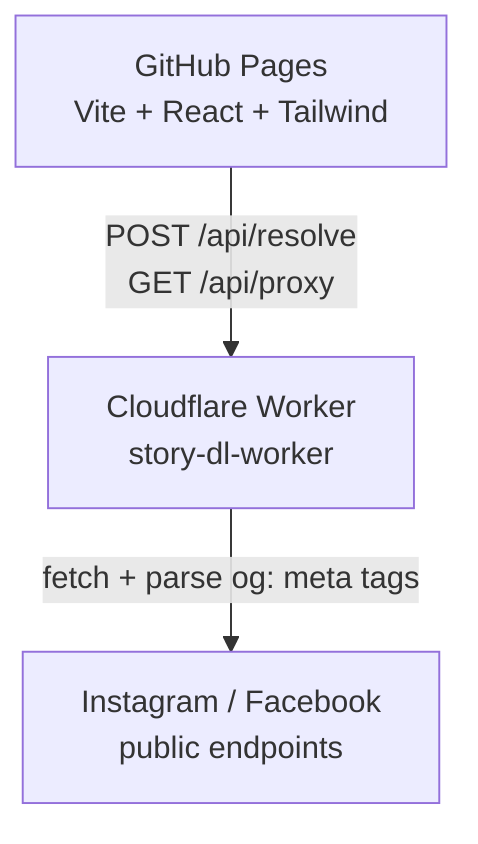

# Social Downloader

Website for downloading public Reels, Posts, and Videos from Instagram and Facebook
via URL. The frontend runs on GitHub Pages, the backend is a Cloudflare Worker
(free tier) acting as a scraper + media proxy.

> **Note**: This tool is intended for personal use and only supports public content
> (`og:` meta tags from anonymous requests). Private content, friends-only posts, and
> Stories generally cannot be downloaded — Meta restricts these to authenticated
> sessions. Downloading copyrighted material may violate Meta's ToS — you are solely
> responsible for how you use it.

## Architecture



- **`frontend/`** — Vite + React + TypeScript + Tailwind SPA. Deployed to GitHub
  Pages via the `.github/workflows/deploy-pages.yml` workflow.
- **`worker/`** — Cloudflare Worker (TypeScript) with 3 routes: `/api/health`,
  `/api/resolve`, `/api/proxy`. Deploy with `wrangler deploy` or via the
  `.github/workflows/deploy-worker.yml` workflow.

## Local setup

### Requirements

- Node.js 22+ (required by Wrangler 4 and Vite 8)
- Cloudflare account (for the Worker) — run `wrangler login` once

### Worker

```bash
cd worker
npm install
npm run dev          # http://127.0.0.1:8787
# Test:
curl http://127.0.0.1:8787/api/health
```

### Frontend

```bash
cd frontend
npm install
cp .env.example .env.local
# Edit .env.local: VITE_WORKER_URL=http://127.0.0.1:8787
npm run dev          # http://localhost:5173
```

## Deploy

### 1. Deploy the Worker to Cloudflare

```bash
cd worker
npx wrangler login
npx wrangler deploy
# Note the URL: https://story-dl-worker.<account>.workers.dev
```

### 2. Create the GitHub repo and enable Pages

```bash
# From the project root
git init
git add .
git commit -m "Initial commit"
gh repo create story-downloader --public --source=. --push
```

Under **Settings → Pages**, set **Source = GitHub Actions**.

### 3. Configure the frontend variable

**Settings → Secrets and variables → Actions → Variables → New repository variable**:

| Name              | Value                                                |
| ----------------- | ---------------------------------------------------- |
| `VITE_WORKER_URL` | `https://story-dl-worker.<account>.workers.dev`      |

> This is a **Variable** (public), not a Secret — the value will be embedded in the
> JS bundle.

### 4. (Optional) Deploy the Worker via GitHub Actions

**Settings → Secrets and variables → Actions → Secrets**:

| Name                    | Description                                       |
| ----------------------- | ------------------------------------------------- |
| `CLOUDFLARE_API_TOKEN`  | Token from Cloudflare → My Profile → API Tokens   |
| `CLOUDFLARE_ACCOUNT_ID` | Cloudflare dashboard → Account ID                 |

### 5. Configure CORS on the Worker

By default, `localhost:5173` and any `*.github.io` origin are allowed. If you use a
custom domain, edit `ALLOWED_ORIGINS` in `worker/wrangler.toml`:

```toml
[vars]
ALLOWED_ORIGINS = "http://localhost:5173,https://your-user.github.io,https://yourdomain.com"
```

Then run `npx wrangler deploy` again.

## Worker API

### `GET /api/health`

```json
{ "ok": true }
```

### `POST /api/resolve`

Supported URL shapes:

- Instagram: `/reel/<id>/`, `/p/<id>/`, `/tv/<id>/`, `/stories/<user>/<id>/` (best-effort)
- Facebook: `/<page>/posts/<id>`, `/<page>/videos/<id>`, `/watch?v=<id>`, `/reel/<id>`, `fb.watch/<id>`, `/stories/<id>` (best-effort)

```json
// Request
{ "url": "https://www.instagram.com/reel/<id>/" }

// Response 200
{
  "platform": "instagram",
  "kind": "reel",
  "mediaItems": [
    { "type": "video", "url": "https://...mp4", "thumbnail": "https://...jpg" }
  ]
}

// Response 4xx/5xx
{ "error": "...", "code": "INSTAGRAM_NO_MEDIA" }
```

Error codes: `INVALID_INSTAGRAM_URL`, `INVALID_FACEBOOK_URL`, `UNSUPPORTED_PLATFORM`,
`INSTAGRAM_NO_MEDIA`, `INSTAGRAM_STORY_BLOCKED`, `INSTAGRAM_RATE_LIMITED`,
`INSTAGRAM_NOT_FOUND`, `INSTAGRAM_FETCH_FAILED`, `FACEBOOK_NO_MEDIA`,
`FACEBOOK_STORY_BLOCKED`, `FACEBOOK_RATE_LIMITED`, `FACEBOOK_NOT_FOUND`,
`FACEBOOK_FETCH_FAILED`, `MISSING_URL`, `HOST_NOT_ALLOWED`, `INTERNAL`.

### `GET /api/proxy?url=<encoded>&filename=<optional>`

Streams media from the IG/FB CDN to the browser with
`Content-Disposition: attachment` to trigger a download. Host whitelist:
`*.cdninstagram.com`, `*.fbcdn.net`, `*.facebook.com`, `*.instagram.com`.

## Roadmap

- [x] Support Instagram Reel / Post / IGTV
- [x] Support Facebook Post / Video / Reel / fb.watch
- [x] Per-platform guide UI with platform selector
- [ ] Support TikTok
- [ ] Bulk download from multiple URLs
- [ ] PWA + mobile share target
- [ ] Dark/light mode toggle
- [ ] i18n VI/EN

## Known limitations

- **Stories** (Instagram and Facebook) generally require an authenticated session.
  Anonymous datacenter-IP requests from a Cloudflare Worker hit rate limits or get
  redirected to login. Stories are kept as best-effort but most will fail.
- **Private accounts** and friends-only posts cannot be downloaded.
- Cloudflare Worker IP ranges are heavily flagged by Meta — even public content can
  be rate-limited. If you hit `*_RATE_LIMITED`, wait 1–2 minutes.
- Some content expires (Stories: 24h); IG/FB return 404 in that case.
- IG/FB change their HTML structure and endpoints frequently — when the parser
  fails, please open an issue or update `worker/src/platforms/*.ts`.
