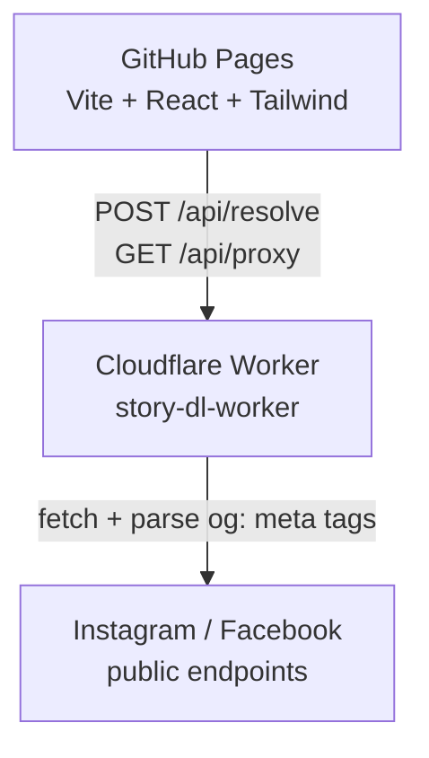

# Architecture

Two-tier deployment: a static SPA on GitHub Pages, and a serverless Cloudflare Worker that handles scraping + proxying media.

## Modules

- **`frontend/`** — Vite + React + TypeScript + Tailwind SPA. Deployed to GitHub
  Pages via `.github/workflows/deploy-pages.yml`. i18n is hand-rolled (no
  external library) and ships with **English, Vietnamese, Japanese, Korean,
  Chinese**.
- **`worker/`** — Cloudflare Worker (TypeScript) with three routes:
  - `GET  /api/health` — liveness probe.
  - `POST /api/resolve` — accepts an Instagram/Facebook URL, fetches the public
    HTML, parses Open Graph meta tags, returns a normalized `mediaItems[]` list.
  - `GET  /api/proxy` — streams CDN media to the browser with
    `Content-Disposition: attachment` so the browser saves it as a file
    (bypasses cross-origin download restrictions).
  Deployed via `wrangler deploy` or `.github/workflows/deploy-worker.yml`.

## Why this split

- The frontend has zero secrets and is fully static — perfect for free GitHub
  Pages hosting.
- The Worker isolates the scraping logic (which needs to evolve as Meta changes
  their HTML) and the CORS-bypassing media proxy (browsers cannot directly
  download cross-origin URLs with a custom filename).
- Cloudflare Workers' free tier (100k requests/day) is generous enough for
  personal use without a credit card.

See [`api.md`](./api.md) for the request/response shapes.
